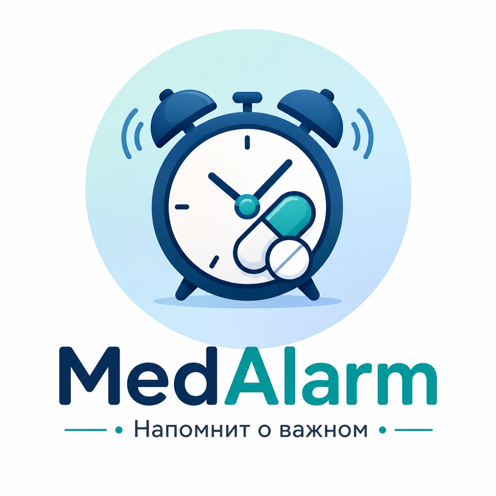
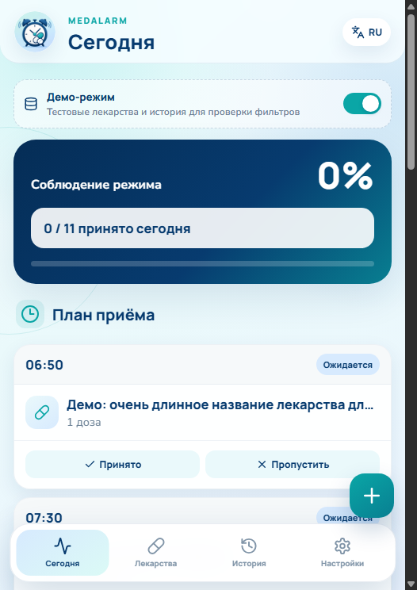
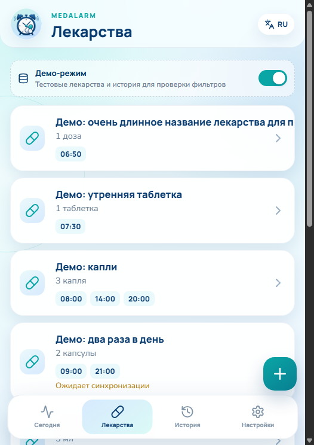
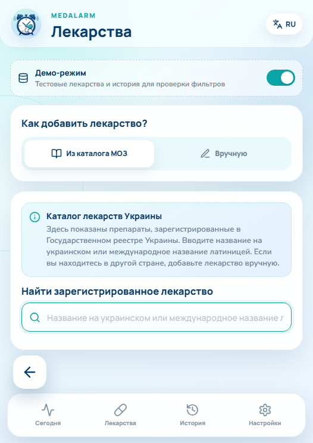
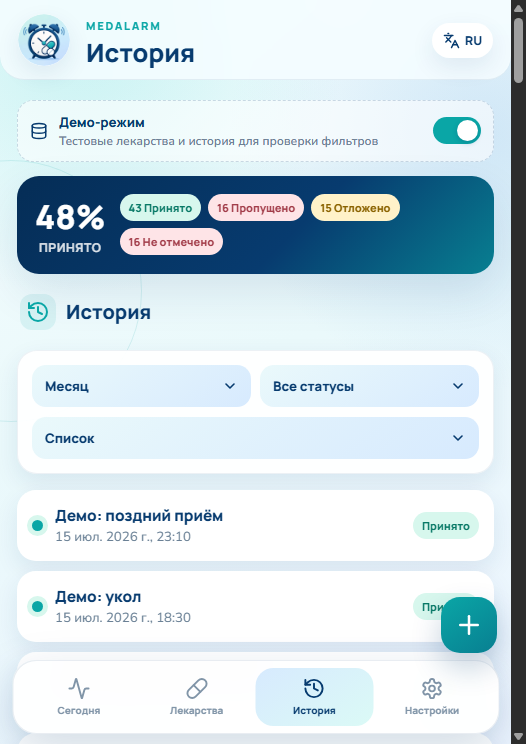

<p align="center">
  <strong>Русский</strong> · <a href="README.uk.md">Українська</a> · <a href="README.en.md">English</a>
</p>

<div align="center">
  
  <h1>MedAlarm</h1>
  <p><strong>Простой Telegram-помощник для напоминаний о приёме лекарств</strong></p>
  <p>
    <a href="https://t.me/med_alarm_bot?start=app">Открыть в Telegram</a>
    · <a href="https://github.com/Miha21222/MedAlarm/releases/latest">Последний релиз</a>
    · <a href="CHANGELOG.md">История изменений</a>
  </p>
</div>

> [!IMPORTANT]
> MedAlarm не даёт медицинских рекомендаций, не подбирает дозировки и не
> меняет схему лечения. Приложение напоминает только о тех лекарствах,
> количестве и времени приёма, которые пользователь ввёл самостоятельно в
> соответствии со своим назначением.

## Что умеет MedAlarm

- ⏰ Отправляет напоминания по заданному пользователем расписанию.
- ✅ Позволяет отметить приём, пропустить его или отложить напоминание прямо в Telegram.
- 💊 Хранит список лекарств, количество для одного приёма, комментарии и несколько времён в день.
- 🔎 Поддерживает ручной ввод и поиск по официальному Государственному реестру лекарственных средств Украины.
- 📊 Показывает план на сегодня и статистику соблюдения расписания.
- 📜 Группирует историю по дням и лекарствам, поддерживает фильтры периода и статуса.
- 🌐 Работает на русском, украинском и английском языках.
- 🔤 Поддерживает три размера текста, тактильный отклик и голосовой ввод там, где это доступно.
- 🔄 Сохраняет лекарства локально и синхронизирует их с сервером после авторизации через Telegram.
- 📨 Принимает оценки и сообщения об ошибках, включая необязательный скриншот.

## Как начать пользоваться

1. Откройте [@med_alarm_bot](https://t.me/med_alarm_bot?start=app) и нажмите **Start** или отправьте `/start`.
2. Нажмите **«Открыть MedAlarm»** в сообщении бота.
3. На вкладке **«Лекарства»** нажмите `+`.
4. Выберите способ добавления:
   - **из каталога МОЗ** — найдите зарегистрированный препарат, затем самостоятельно укажите назначенное количество и время;
   - **вручную** — заполните название, количество, комментарий и расписание самостоятельно.
5. Сохраните лекарство. Оно появится в плане на сегодня и будет синхронизировано с сервером.
6. Когда придёт реальное напоминание, отметьте **«Принял»**, **«Пропустить»** или **«Напомнить позже»**.
7. Используйте вкладку **«История»**, чтобы посмотреть выполненные и пропущенные приёмы.

Черновик формы сохраняется автоматически. Можно уйти со страницы, переключиться между ручным вводом и каталогом и вернуться без потери введённых данных.

## Интерфейс

На скриншотах включены демонстрационные данные — это примеры интерфейса, а не медицинские назначения.

<table>
  <tr>
    <td align="center">
      <br />
      <strong>План на сегодня</strong><br />Предстоящие приёмы и быстрые действия
    </td>
    <td align="center">
      <br />
      <strong>Лекарства</strong><br />Количество, время и состояние синхронизации
    </td>
  </tr>
  <tr>
    <td align="center">
      <br />
      <strong>Добавление</strong><br />Каталог МОЗ или ручной ввод
    </td>
    <td align="center">
      <br />
      <strong>История</strong><br />Статистика, периоды и фильтры
    </td>
  </tr>
</table>

## Как это работает

MedAlarm состоит из четырёх частей:

- **Telegram-бот** на `aiogram 3` регистрирует пользователя и доставляет напоминания.
- **Планировщик** на APScheduler создаёт задания по сохранённому расписанию и восстанавливает отложенные напоминания после перезапуска.
- **Backend API** на FastAPI и async SQLAlchemy проверяет Telegram `initData`, синхронизирует лекарства и обслуживает настройки, план, историю и обратную связь.
- **Telegram Mini App** на React, TypeScript и Vite предоставляет мобильный интерфейс.

Основные данные хранятся в SQLite. Лекарства синхронизируются по модели local-first с разрешением конфликтов по времени последнего изменения. Реальная история приёмов остаётся серверной и всегда привязана к событию напоминания.

## Локальный запуск

### Вариант 1: интерфейс с тестовой авторизацией

Нужны Node.js 22+ и npm:

```powershell
cd frontend
npm install
npm run dev:local
```

Откройте `http://localhost:5173/`. Локальный preview использует тестовую Telegram-идентификацию и позволяет включить изолированный демо-режим. Демо-данные никогда не отправляются как настоящая история приёмов.

### Вариант 2: бот, API и планировщик в Docker

1. Скопируйте `.env.example` в `.env`.
2. Укажите как минимум действительный `BOT_TOKEN`, безопасный `JWT_SECRET`, HTTPS-адрес Mini App и разрешённые CORS origins.
3. Запустите стек:

```powershell
docker compose up --build -d
```

Docker запускает API и общий процесс бота с планировщиком. Для production-профиля также доступен Cloudflare Tunnel.

### Вариант 3: отдельные процессы для разработки

Нужен Python 3.12+:

```powershell
python -m venv .venv
.venv\Scripts\Activate.ps1
pip install -r requirements.txt
python -m app.catalog_update
uvicorn app.api.main:app --reload --host 0.0.0.0 --port 8000
```

В отдельных терминалах:

```powershell
python -m app.bot_main
python -m app.scheduler
```

Для обычного локального запуска бота вместе с планировщиком можно использовать `python main.py`.

## Проверка изменений

```powershell
python -m pytest
cd frontend
npm run test:local
npm run build
```

CI дополнительно собирает Docker-образ, проверяет production Compose и публикует Mini App на GitHub Pages после изменений в `main`.

## Каталог лекарств

Поиск использует открытые данные Государственного реестра лекарственных средств Украины с портала [data.gov.ua](https://data.gov.ua/) на условиях **CC BY**. Каталог предоставляет только справочные сведения: название, форму выпуска, состав, производителя, регистрационные данные, ATC и ссылку на официальную инструкцию. Количество и расписание всегда вводит пользователь.

Обновить локальную копию каталога:

```powershell
python -m app.catalog_update
```

## Развёртывание и обслуживание

Production использует один backend-контейнер на VPS, постоянный SQLite volume, Telegram long polling и Cloudflare Tunnel. Не запускайте несколько backend-реплик, пока приложение использует SQLite и единый процесс Telegram polling.

Инструкции по первому развёртыванию, релизам, резервному копированию, восстановлению и откату находятся в [`deploy/README.md`](deploy/README.md).

## Структура проекта

```text
app/
├── api/          # FastAPI API и Telegram-аутентификация
├── database/     # SQLAlchemy-модели, сессии и SQLite-миграции
├── handlers/     # /start, /app и действия из напоминаний
├── scheduler/    # задания APScheduler и доставка напоминаний
└── services/     # бизнес-логика и запросы к базе данных
frontend/         # React/Vite Telegram Mini App
tests/            # backend-тесты
frontend/tests/   # тесты чистой frontend-логики
deploy/           # релизы, backup, restore и production-инструкции
```

## Лицензии и ответственность

Исходный код проекта распространяется согласно файлу лицензии репозитория, если он присутствует. Данные украинского Государственного реестра используются с обязательной атрибуцией по лицензии CC BY.

MedAlarm — инструмент организации напоминаний, а не медицинская информационная система. По вопросам назначения, изменения или отмены лечения необходимо обращаться к квалифицированному медицинскому специалисту.
